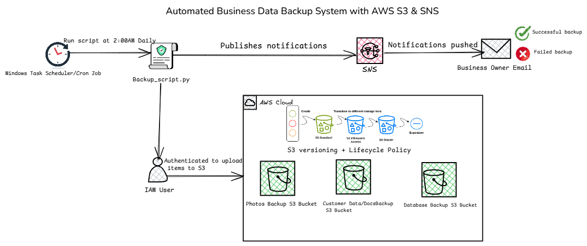

# Automated Cloud Backup System for Small Businesses Python + AWS(S3 + SNS)

## Executive Summary
This project demonstrates a practical cloud backup solution tailored for small businesses. It automatically secures local files by uploading them to Amazon S3, applies versioning for recovery, and sends real‑time email notifications via Amazon SNS. By combining Python automation with AWS services, the system reduces the risk of data loss and ensures business continuity without manual intervention.

---
## Key Features
- 🔒 **Secure Cloud Storage**: Files backed up to Amazon S3 with versioning enabled.
- 📧 **Automated Notifications**: Email alerts via Amazon SNS for success or failure.
- ⚡ **Efficient Transfers**: Large CSV files compressed before upload.
- 📝 **Detailed Logging**: Backup logs for troubleshooting and validation.
- 🔄 **Smart State Tracking**: Avoids re‑uploading unchanged files.
- 🕑 **Scheduled Automation**: Runs daily using Windows Task Scheduler.
- 🛠️ **Error Handling**: Graceful recovery from common issues (permissions, credentials, file access).

---

## Real World Scenario
Many small businesses store important data locally, such as:

- Customer documents
- Photos and media files
- Database exports (CSV files)

These businesses often face challenges such as:

- Backups being forgotten or done inconsistently
- No offsite copy of critical data
- No confirmation that backups actually succeeded

This project simulates how a small business owner can ***automate backups and receive confirmation emails by downloading the script, configuring it on their machine, and scheduling it to run automatically.***

---
## Architecture Overview



---
## Technologies Used
- ***Python (Boto3)*** – Backup automation

- ***Amazon S3*** – Object storage

- ***S3 Versioning*** – File recovery & history

- ***Amazon SNS*** – Email notifications

- ***Windows Task Scheduler*** – Automation

---
## Resource Configuration
### Amazon S3 Configurations
**Step 1: Create Amazon S3 Bucket**

- Log in to the AWS Management Console → S3 → Create bucket.

- Create three buckets (or fewer, depending on your needs):

  database-backup-XXX

  documents-backup-XXX

  photos-backup-XXX

**Step 2: Enable Versioning**

- Open each bucket → Properties → Bucket Versioning → Enable.

This ensures every backup version is preserved, even if files are overwritten.

**Step 3: Configure Lifecycle Rules**

- Bucket → Management → Lifecycle rules → Create rule.

Example rule:

Transition non‑current versions to Glacier Flexible Retrieval after 30 days.

Optionally, expire non‑current versions after 365 days.

### Amazon SNS Configurations

**Step 1: Create a Topic**

- Go to AWS Management Console → SNS → Create topic.

- Choose Standard type.

- Name it something like BackupNotifications

**Step 2: Create a Subscription**

- Select the topic → Create subscription.

- Protocol: Email.

- Endpoint: enter the business owner’s email address.

- Confirm the subscription by clicking the link in the email AWS sends.

**Step 3: Get the Topic ARN**

- Copy the ARN from the topic details page.

- Paste it into your script (TOPIC_ARN variable).

### IAM Configurations
**Step 1: Create a User**

- AWS Console → IAM → Users → Add users.

- Name: backup-script-user.

- Select Programmatic access (for CLI/API).

**Step 2: Attach Policies**

- Grant the user permissions to:

AmazonS3FullAccess (or a custom policy limited to your backup buckets).

AmazonSNSFullAccess (or a custom policy limited to your notification topic).

- Download Credentials

- Save the generated Access Key ID and Secret Access Key.

- Configure them locally using the AWS CLI:  *aws configure*

- Enter the keys and default region (e.g., us-east-1).

---

## Backup Script Design

The Python backup script performs the following tasks:

- **Scans configured local folders recursively**  
  Walks through `database`, `customer-data-docs`, and `pictures` directories.

- **Compresses database CSV files before upload**  
  Ensures large CSVs are zipped to reduce transfer size.

- **Uploads files to the appropriate S3 bucket**  
  - Database → `database-backup-254`  
  - Documents → `documents-backup-254`  
  - Photos → `photo-backup-254`

- **State tracking to avoid re‑uploading unchanged files**  
  Uses `backup_state.txt` to record previously uploaded files and skip duplicates.

- **Logging to a backup log file**  
  - Writes detailed logs to `backup_log.txt`.  
  - Logs start time, folders scanned, files uploaded, and any errors.  
  - Provides clear success/failure messages for troubleshooting.

- **Sends an email notification upon completion or failure**  
  - Success → “Backup completed successfully.”  
  - Failure → Includes error details from the log.

- **Error handling for common issues**  
  - Bucket access errors  
  - Invalid credentials  
  - File read/write errors  
  - Logs exceptions with stack traces for debugging

---

## Automation and Scheduling

### Task Scheduler Configuration for Daily Backup Script
Navigate to Computer Management on Windows > Task Scheduler > Right Click > "Create Task"
Configure the Task Scheduler as follows:

## General Tab
- **Name**: Daily Backup Script
- **Run whether user is logged on or not**: Enabled (recommended if using `C:\automatic_backup`)
- **Run with highest privileges**: Enabled
- **Configure for**: Windows 10/11


## Triggers Tab
- **New Trigger**:
  - **Begin the task**: On a schedule
  - **Schedule type**: Daily
  - **Recur every**: 1 days
  - **Start time**: 02:00 AM
  - **Enabled**: Yes


## Actions Tab
- **New Action**:
  - **Action**: Start a program
  - **Program/script**:  
    ```
    "C:\Program Files\Python313\python.exe"
    ```
  - **Add arguments (optional)**:  
    ```
    "C:\automatic_backup\backup_script.py"
    ```
  - **Start in (optional)**:  
    ```
    C:\automatic_backup
    ```

## Conditions Tab 
- **Power**: Uncheck *Start only if the computer is on AC power* (optional) 
- **Idle**: Leave unchecked
 - **Wake the computer to run this task**: Enabled

## Settings Tab 
- **Allow task to be run on demand**: Enabled
 - **Run task as soon as possible after a scheduled start is missed**: Enabled 
 - **If the task fails, restart every X minutes**: Optional 
 - **Stop the task if it runs longer than**: Optional

---

## Testing and Validation
The following tests were performed:

- Automatic execution of the script

- Verification of uploaded objects in S3

- Confirmation of S3 versioning behavior by running the script twice. Versioning ensured that it preserved multiple variants of the same object in the same bucket preventing accidental deletions or overwrites.

- Successful receipt of email notifications via SNS

- Validation that compressed database files were uploaded correctly

Lifecycle policy transitions were configured but not fully observed due to minimum AWS timing constraints.
Amazon S3 Lifecycle policies were chosen to automatically transition older backups to lower‑cost storage and delete stale versions, ensuring long‑term cost efficiency and data management without manual effort.

***Check project's screenshot folder for validation results***

---

## Troubleshooting: Task Scheduler + Python Backup Script

### The Issue Encountered

1. Desktop Folder Access Problem

- When all folders and files were stored on say **Desktop**, the task failed whether run manually or automatically.  
- **Reasoning**: Desktop is a user‑specific folder tied to the interactive session. Scheduled tasks (especially with "Run whether user is logged on or not") may not consistently have permission to access Desktop paths. Even manual runs through Task Scheduler can inherit this restricted context.  

- **How to Resolve It**

### Option 1: Move folders to a neutral location (recommended)
- Place `database`, `customer-data-docs`, and `pictures` under `C:\automatic_backup`.  
- Update the script to use absolute paths pointing to `C:\automatic_backup`.  
- Configure Task Scheduler:
  - **Program/script**: `"C:\Program Files\Python313\python.exe"`
  - **Arguments**: `"C:\automatic_backup\backup_script.py"`
  - **Start in**: `C:\automatic_backup`

This works reliably because `C:\automatic_backup` is accessible system‑wide, regardless of user context.

### Option 2: Keep folders on Desktop but use full paths
- Keep folders under `C:\Users\<YourName>\Desktop`.  
- Update the script to use absolute paths pointing to Desktop.  
- Configure Task Scheduler:
  - **Program/script**: `"C:\Program Files\Python313\python.exe"`
  - **Arguments**: `"C:\Users\<YourName>\Desktop\automatic_backup\backup_script.py"`
  - **Start in**: `C:\Users\<YourName>\Desktop\automatic_backup`
  - **General tab**: set **Run only when user is logged on** (so Desktop is accessible).


2. Default Working Directory Problem
- By default, Task Scheduler starts tasks in: C:\Windows\System32

 - If your script relies on **relative paths** (e.g., `backup_state.txt`, `backup_log.txt`), it will look in `System32` instead of the script’s folder. Result: The script fails because required files are not found.  

- **Fix**: Explicitly set the **"Start in"** field in the **Actions tab** to the script’s directory.

3. Full Path Solution
- If files remain on Desktop but you reference them with **absolute paths** (e.g., `C:\Users\<YourUser>\Desktop\backup_state.txt`), the task runs successfully.  
- **Reasoning**: Absolute paths bypass the working directory issue and tell the script exactly where to find files. This avoids confusion with `System32`.  
- **Caveat**: While absolute paths work, they still depend on the task having permission to access Desktop. Neutral folders like `C:\automatic_backup` are more reliable.

---

## Business Owner Script Setup Instructions
To use this script, a business owner must:

1. Install Python and required libraries

2. Create AWS resources (S3 buckets, SNS topic, IAM user)

3. Configure AWS credentials locally

4. Download and configure the backup script

5. Set up a scheduled task for automation

6. Verify backups and notifications

Detailed setup steps are included in the project documentation.
